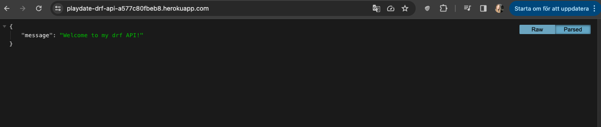
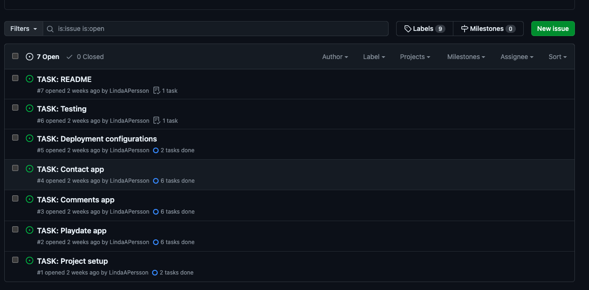
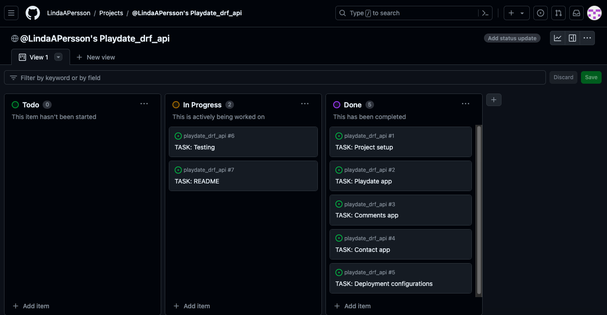
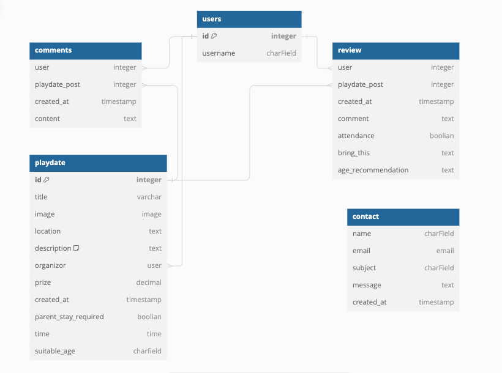

# Playdate

Playdate is an application designed to simplify the process of arranging playdates for parents. As any parent knows, it can often take hours or even days to coordinate schedules and respond to text messages amidst the chaos of daily life. This app aims to alleviate the challenges associated with scheduling playdates, making it easier for parents to connect and organize opportunities for their children to socialize and play together.

Link to API:
[Link to playdate drf-api](https://playdate-drf-api-a577c80fbeb8.herokuapp.com/)

Link to front-end site connected to the API:
[Link to playdate](https://playdate-184e33ed70de.herokuapp.com/)

## Agile Workflow

Agile Methodology was used to help prioritize and organize tasks for the hole webpage. I used Project Boards on Github.

* User stories were created by looking at epics and added on as the project was advancing.
* Project Board was used to track progression of the task through the Todo, In progress and Done columns.

 Userstories / Project board

To see the Epic and user stroies in full: [Project Board](https://github.com/users/LindaAPersson/projects/8).

## User storie

### Admin user
The back-end section of the project focuses on its administrative side, so that's the only user story I will focus on:

As an admin, I want to be able to create, edit, and delete users, playdates, comments, and reviews so that I can have control over the content of the application and remove any potential inappropriate content. Additionally, I want to be able to read all the contact forms that users send.

## Database Design
The following models were created to represent the database model structure of the application:

### Models

## Features

### Future features

## Testing

## Technologies used

## Deploying

## Credits