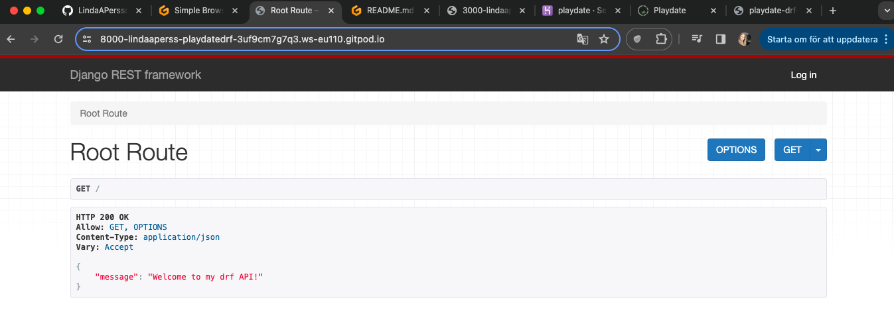

# Playdate

Playdate is an application designed to simplify the process of arranging playdates for parents. As any parent knows, it can often take hours or even days to coordinate schedules and respond to text messages amidst the chaos of daily life. This app aims to alleviate the challenges associated with scheduling playdates, making it easier for parents to connect and organize opportunities for their children to socialize and play together.

Link to API:
[Link to playdate drf-api](https://playdate-drf-api-a577c80fbeb8.herokuapp.com/)

Link to front-end site connected to the API:
[Link to playdate](https://playdate-184e33ed70de.herokuapp.com/)

## Agile Workflow

Agile Methodology was used to help prioritize and organize tasks for the hole webpage. I used Project Boards on Github.

* User stories were created by looking at epics and added on as the project was advancing.
* Project Board was used to track progression of the task through the Todo, In progress and Done columns.

 Userstories / Project board

To see the Epic and user stroies in full: [Project Board](https://github.com/users/LindaAPersson/projects/8).

## User storie

### Admin user
The back-end section of the project focuses on its administrative side, so that's the only user story I will focus on:

As an admin, I want to be able to create, edit, and delete users, playdates, comments, and reviews so that I can have control over the content of the application and remove any potential inappropriate content. Additionally, I want to be able to read all the contact forms that users send.

## Database Design
The following models were created to represent the database model structure of the application:

### Models

#### User Model
The User model contains information about the user. It is part of the Django allauth library.
* ForeignKey relation with the Playdate model owner field
Fo* reignKey relation with the Comment model owner field
* ForeignKey relation with the Review model owner field

#### Playdate Model
The Playdate model contains the following fields: title, image, location, description, organizor, prize, created_at, parent_stay_required, time, suitable_age.
* ForeignKey relation with the Comment model post field
* ForeignKey relation with the Review model post field

#### Comment Model
The Comment model contains the following fields: user, playdate_post, created_on, content.
* ForeignKey relation between the user field and the User model id field.
* ForeignKey relation between the Playdate field and the User model playdate_post field.

#### Review Model
The Review model contains the following fields: user, playdate_post, created_on, comment, attendance, bring_this, age_recommendation.
* ForeignKey relation between the user field and the User model id field.
* ForeignKey relation between the Playdate field and the User model playdate_post field.

#### Contact Model
The Contact model contains the following fields: name, email, subject, message, created_on.

## Features

### Future features
In DEV:

 Start page

 Playdate

 Playdate Filter

 Playdate Detail

 Add, Edit, Delete Playdate (signed in)

 Comment

 Comment Filter

 Comment Detail

 Add, Edit, Delete Commment (signed in)

 Review

 Review Filter

 Review Detail

 Add, Edit, Delete Review (signed in)

 Contact

## Testing

To see all testing done, please see: [TESTING.md](TESTING.md)

## Technologies used

### Languages & Frameworks
* Python
* Django

### Libraries & Tools
* Cloudinary to store static files
* Dbdiagram.io used for the database schema diagram
* Git was used for version control via Gitpod terminal to push the code to GitHub
* GitHub was used as a remote repository to store project code
* Gitpod - a virtual IDE workspace used to build this site
* Django REST Framework was used to build the back-end API
* Django AllAuth was used for user authentication
* Pillow was used for image processing and validation
* Psycopg2 was used as a PostgreSQL database adapter for Python
* ElephantSQL – deployed project on Heruko uses a ElephantSQL database

## Deploying

## Credits