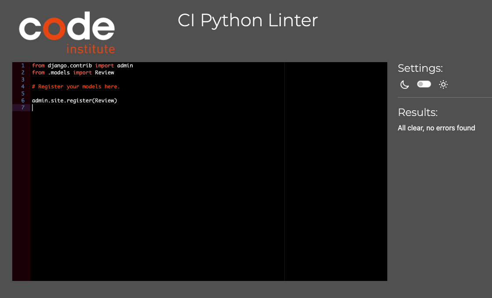
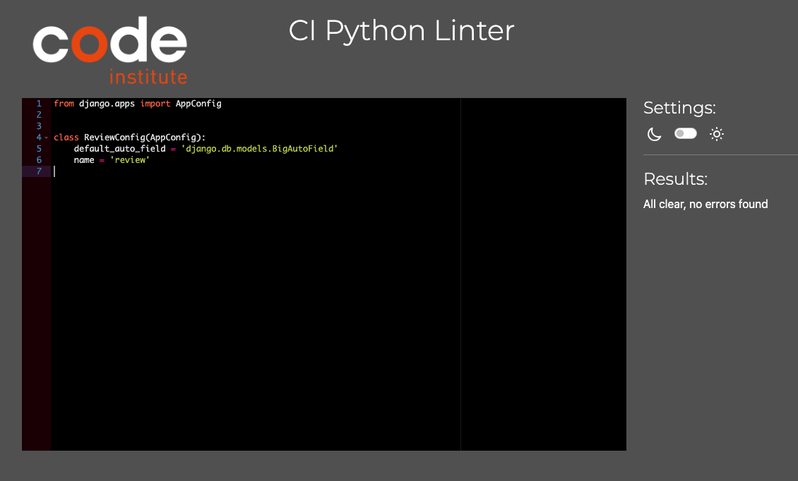
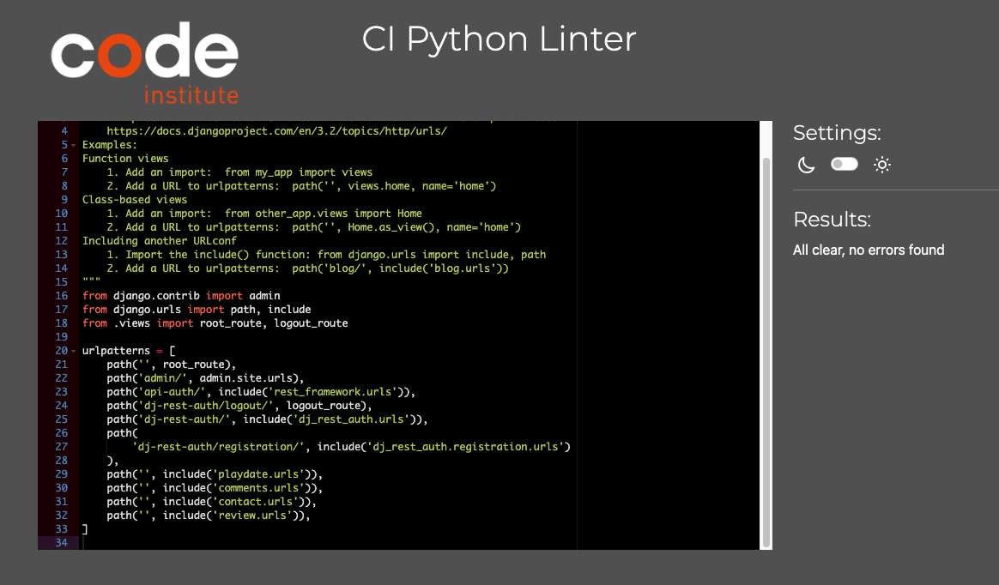

# Playdate

This file only contains the exstensive testing done to the webpage. All other information regarding the site will be found in [README](README.md).

## Pep8 

### Playdate

 Admin

 Apps

 Filter

 Models

 Permission

 Serializer

 Urls

 Views

### Comments

 Admin

 Apps

 Models

 Serializer

 Urls

 Views

### Contact

 Admin

 Apps

 Models

 Serializer

 Urls

 Views

### Review

 Admin

 Apps

 Models

 Serializer

 Urls

 Views

### DRF API

 Permission

 Serializer

 Setting

 Urls

 Views

